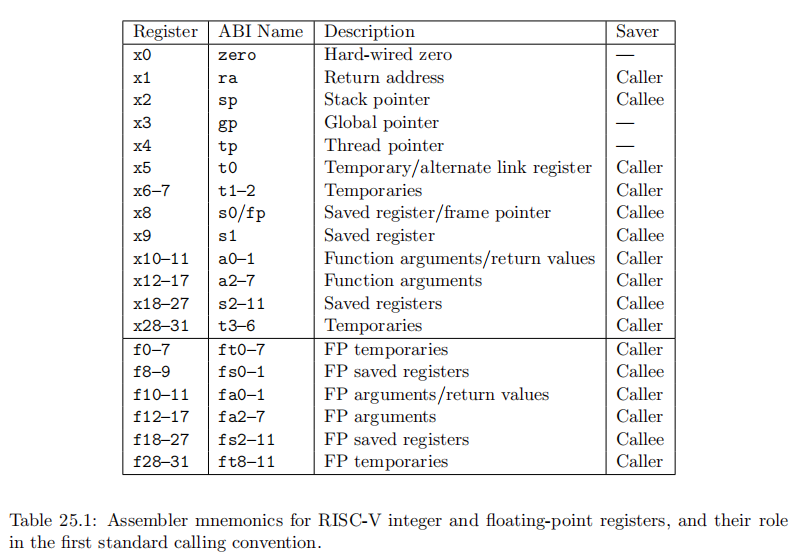

# c语言和汇编的相互转化

本文描述c语言如何编译到汇编，链接后，相互调用的过程发送了什么，以riscv架构为主，会稍微涉及一些x86 32位的情况。

## 程序的调用栈

栈是一种先进先出的数据结构。程序的调用栈是一块内存空间，程序运行的时候，通过栈指针控制数据的进出。如果是带os的环境，由操作系统创建进程的时候分配，如果是裸板开发，一般由crt.S 分配栈空间。

函数调用栈用于存放函数调用过程中的临时数据，包括函数中的局部变量，返回地址。

### 为什么要有函数调用栈

程序由数据与指令构成，如果传入的参数和临时数据全部放在寄存器，然后直接寄存器之间的计算，对于简单的计算是够用的，然而当数据的数量超过通用寄存器个数，我们不得不将数据存起来，在做计算的时候再将数据取出到寄存器参与运算，当计算结束后，如果原数据可以被释放，则只需要一快临时的内存空间存储，将计算结果保留到某个寄存器。

如果函数发生调用，需要记录调用后应该返回的位置，这同样可以存放在寄存器中，如果调用过程超过寄存器个数，同样会遇到寄存器不够的问题。如果不够，我们依然将返回地址保存在栈上。

这样我们需要一种先申请，先释放的结构保存函数调用过程中临时使用的数据和完成函数后的返回地址，栈正是这样一种先进先出的数据结构，因此，我们在计算机的内存中划分一块区域，通过一个寄存器记录栈顶，这样一个简单的结构来保存存储函数调用的临时资源。

- 如果想更深入了解栈的历史，推荐阅读《栈的简史》。

## 应用二进制接口(abi)

我们做出一些规定，c代码映射到汇编的过程中，如何分配通用寄存器与栈，这个规定就是调用约定。这个约定i受指令架构影响。指令架构决定了有多少个可用的寄存器，编译器决定如何使用这些寄存器和栈完成计算过程。这样就能完成汇编和c相互调用。

### riscv abi简介

riscv有32个通用寄存器，从x0到x31，其中x0固定为0。官方介绍如下：

x1寄存器当作返回地址，如果调用超过一层，将上一层的返回地址从ra保存到栈，将当前返回地址存入ra。

x2寄存器栈指针寄存器。x8栈指针寄存器。x,10-x11，返回寄存器。x12-17，参数寄存器，x18-27寄存器

## c编译到汇编

根据abi从c到汇编。

## 汇编调用c函数

## c调用汇编函数